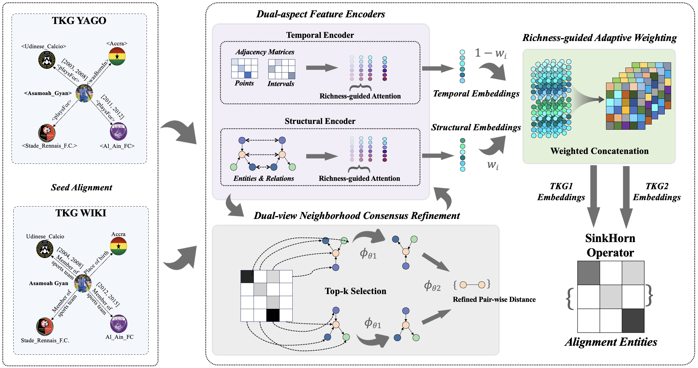

# [RCTEA: Richness-guided Co-training for Temporal Entity Alignment](https://aclanthology.org/2026.findings-acl.1958/)

RCTEA is a richness-guided co-training framework for temporal entity alignment. It jointly models both structural and temporal aspects of the TKGs for entity alignment. A richness-guided attention mechanism along with an adaptive weighting strategy are designed to facilitate effective feature fusion. To ensure robust alignment despite noisy entity contexts, a dual-view neighborhood consensus algorithm jointly refines the feature encoders to enforce local structural consistency of the predicted alignments.



## 🌟 Datasets

* ent_ids_1: ids for entities in source TKG;
* ent_ids_2: ids for entities in target TKG;
* ref_pairs: the aligned entity pairs;
* triples_1: relation triples encoded by ids in source TKG;
* triples_2: relation triples encoded by ids in target TKG;
* time_id: ids for temporal points;
* rel_id_1: ids for relations in the source TKG;
* rel_id_2: ids for relations in the target TKG;

## 🚀 Quick Start

* Create the environment using the environment.yml file.
* Configure the dataset specification to run the model with a specific dataset such as YAGO-WIKI20K and ICEWS (the default dataset is YAGO-WIKI180K).
* Run main.py train and evaluate the model.

You may also run main_gen_seeds.py to produce alignment seeds, test the seed accuracy, and generate a certain number of seeds to train the model.

## 🍀 Citation

If you find our model, dataset, and experimental results useful, please kindly cite the following paper:
```
@inproceedings{li2026rctea,
    title = "{RCTEA}: Richness-guided Co-training for Temporal Entity Alignment",
    author = "Li, Jiayun and Hua, Wen and Fan, Shiqi and Jin, Fengmei and Jiang, Haiyang and Li, Xue",
    booktitle = "Findings of the {A}ssociation for {C}omputational {L}inguistics: {ACL} 2026",
    year = "2026",
    doi = "10.18653/v1/2026.findings-acl.1958",
    pages = "39295--39310"
}
```
